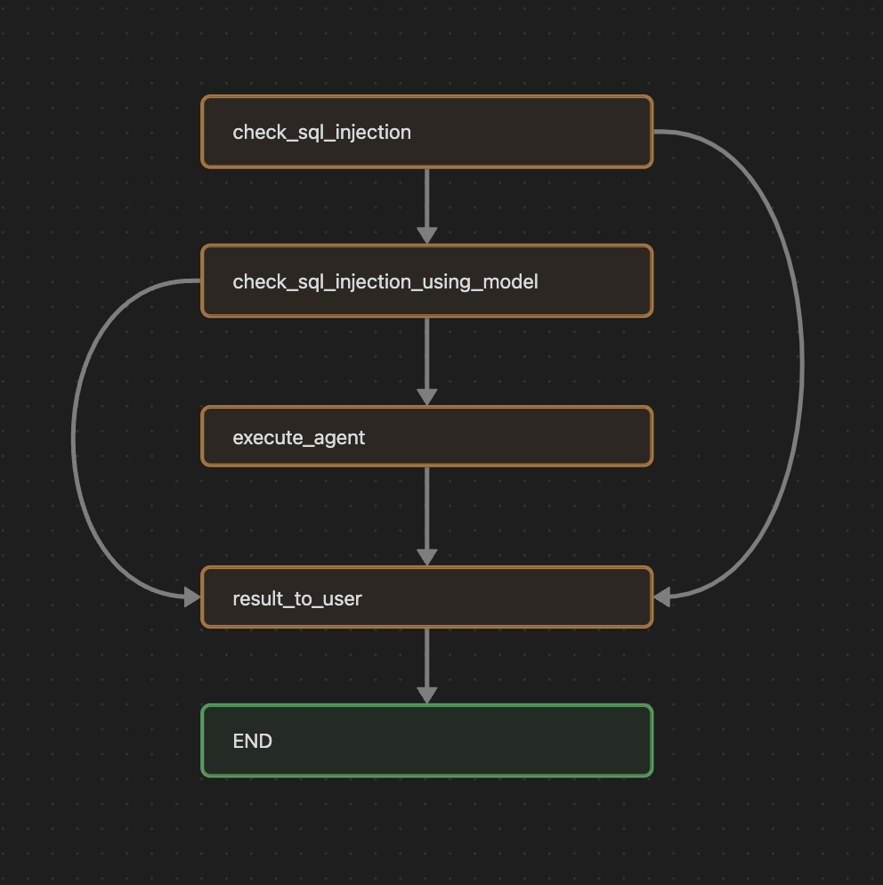

# SQLAgentLangChain
SQLAgent usando LangChain e LangGraph.
Utilizado programação estruturada, pois durante os estudo dos frameworks foi verificado que era o paradigma mais comum. 

## requirement.txt

Contém as bibliotecas utilizadas durante esse desenvolvimento. 
Gerado através do comando.
`pip3 freeze > requirement.txt`

## database.sql 
Contém os SQL para criação do banco de dados usado para o teste.

## .env
Adicionar um .env com as seguintes informações abaixo para o correto funcionamento do script.

```python
#KEY DA AI - Nesse caso feito para OPENAI
OPENAI_API_KEY="COLOQUE SUA KEY"
# Defina o modelo desejado. 
MODEL_AI ="gpt-3.5-turbo"

# Informações do Banco de dados postgree Postgresql
# Mantive os valores para demostrar o acesso ao banco de teste na minha máquina
# Caso fosse subir em um git de desenvvolvimento real apagaria os valores para evitar vazamento de dado sensivel. 
DB_TYPE="postgresql"
DB_LIBRARY="psycopg2"
DB_HOST="localhost"
DB_DATABASE="SQLAgent"
DB_USER="root"
DB_PASS="admin"
```

## Esquema Visual do LangGraph


